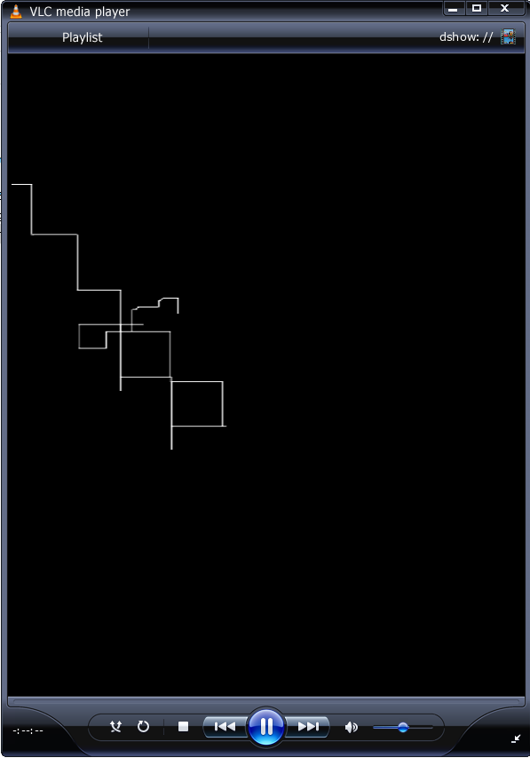
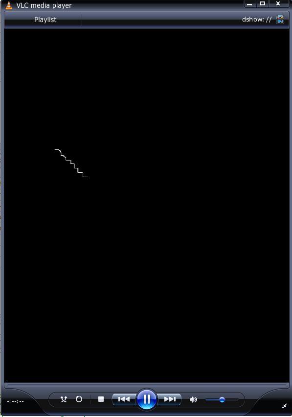
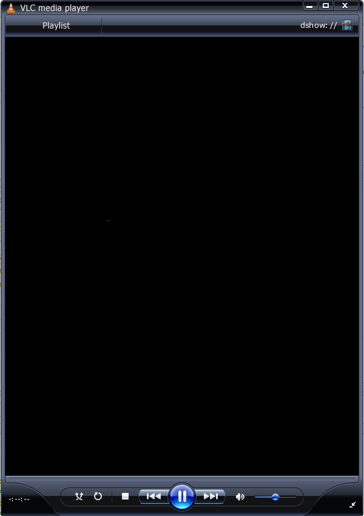

# TP_linux_embarque_HIMED_BENJEMAA

# TP1 – Écran magique

## Introduction

Dans ce TP, l’objectif est de concevoir une version numérique de l’**écran magique** (ou télécran) à l’aide d’un FPGA.  
Le déplacement du stylet est assuré par des **encodeurs incrémentaux**, tandis que l’affichage sera réalisé via la sortie HDMI de la carte **DE10-Nano**.

Le projet est découpé en plusieurs parties, chacune suivant la démarche classique de conception en logique numérique :
- conception du schéma,
- implémentation en VHDL,
- simulation sous **ModelSim**,
- test sur la carte FPGA à l’aide de **Quartus Prime Lite**.

---

## 1. Gestion des encodeurs

Cette première partie se concentre sur la **gestion des encodeurs incrémentaux**.  
L’affichage est volontairement mis de côté afin de se focaliser sur l’acquisition des signaux, la détection des fronts et la détermination du sens de rotation.

### Détection d’un front montant / descendant avec deux bascules D

Le montage utilisant **deux bascules D en série** permet de mémoriser :
- l’état **courant** du signal,
- l’état **précédent** du signal,

tous deux échantillonnés sur le signal d’horloge `clk`.

#### Principe

On note :
- `q0` : sortie de la **première bascule D** → état courant du signal
- `q1` : sortie de la **seconde bascule D** → état précédent du signal

En comparant ces deux valeurs, on peut détecter les fronts :

- **Front montant (0 → 1)**
- **Front descendant (1 → 0)**


Ces signaux (`rise` et `fall`) sont des **impulsions d’un seul cycle d’horloge**.

Dans le schéma fourni, le bloc `???` correspond à cette **logique combinatoire**, chargée de comparer `q0` et `q1` afin de générer le signal d’événement `E`.

---

### Prise en compte du sens de rotation (encodeur en quadrature A/B)

Un encodeur incrémental fournit deux signaux `A` et `B` en **quadrature**.  
Le sens de rotation est déterminé en observant l’état de l’autre signal au moment du front.

#### Règles de décision

**Incrémenter le registre :**
- `riseA` lorsque `B = 0`
- `fallA` lorsque `B = 1`

**Décrémenter le registre :**
- `riseB` lorsque `A = 0`
- `fallB` lorsque `A = 1`


```vhdl
-- Synchronisation des voies A et B (encodeur gauche)
r_A_sync_left <= r_A_sync_left(0) & i_left_ch_a;
r_B_sync_left <= r_B_sync_left(0) & i_left_ch_b;
```
sync(0) : état courant du signal
sync(1) : état précédent du signal

Cette étape permet d’éviter la métastabilité et de disposer de deux échantillons consécutifs pour détecter les fronts.


## Implémentation de la solution en VHDL
### Détection des fronts montants et descendants

À partir des deux échantillons, on peut détecter les fronts :

```vhdl
v_A_rising  := (sync_A(0) = '1' and sync_A(1) = '0'); -- front montant
v_A_falling := (sync_A(0) = '0' and sync_A(1) = '1'); -- front descendant
```

un front montant correspond à une transition 0 → 1
un front descendant correspond à une transition 1 → 0
Ces signaux sont des impulsions d’un seul cycle d’horloge.

### Détermination du sens de rotation (quadrature)

Un encodeur incrémental fournit deux signaux A et B en quadrature.
Le sens de rotation est déterminé en observant le front détecté sur une voie et l’état instantané de l’autre voie.

Incrémentation de la coordonnée : 
```vhdl
if (A_rising and B = '0') or (B_falling and A = '0') then
    coord <= coord + 1;
end if;
```
Décrémentation de la coordonnée : 
```vhdl
if (B_rising and A = '0') or (A_falling and B = '0') then
    coord <= coord - 1;
end if;
```
Cette logique permet de distinguer les deux sens de rotation de l’encodeur.

###  Saturation des coordonnées

Les coordonnées sont limitées à une plage valide (ici 10 bits) afin d’éviter tout débordement :
```vhdl
if coord < MAX_COORD then
    coord <= coord + 1;
end if;

if coord > 0 then
    coord <= coord - 1;
end if;
```

### Conclusion :

La gestion des encodeurs repose sur :
- la synchronisation des entrées,
- la détection des fronts,
- l’exploitation de la quadrature A/B pour déterminer le sens,
- la mise à jour sécurisée des coordonnées.

Ce module fournit ainsi des coordonnées X et Y fiables, utilisables par la suite pour le déplacement du stylet sur l’écran magique.

## 2. Contrôleur HDMI

### Objectif

- Réutiliser le composant `hdmi_controler` développé en TD.
- Générer les signaux vidéo (HS, VS, DE).
- Récupérer les coordonnées pixel `x` et `y`.
- Produire une image de test visible à l’écran.
- Vérifier la correspondance des composantes couleur.

---

### Instanciation du contrôleur HDMI

Le contrôleur est cadencé par l’horloge issue de la PLL.

```vhdl
u_hdmi : entity work.hdmi_controler
port map (
  i_clk   => s_clk_27,
  i_rst_n => s_rst_n,

  o_hdmi_hs => o_hdmi_hs,
  o_hdmi_vs => o_hdmi_vs,
  o_hdmi_de => o_hdmi_de,

  o_pixel_en      => open,
  o_pixel_address => open,
  o_x_counter     => s_x_counter,
  o_y_counter     => s_y_counter
);
```

### Rôle des signaux importants :

- `o_hdmi_hs`, `o_hdmi_vs` : synchronisations horizontale et verticale  
- `o_hdmi_de` : Data Enable (zone visible)  
- `o_x_counter`, `o_y_counter` : coordonnées du pixel courant  


### Génération d’une image de test :
Pour valider le pipeline HDMI, on génère une image simple à partir des compteurs x et y.

- o_hdmi_tx_d(23 downto 16) <= std_logic_vector(to_unsigned(s_x_counter, 8)); -- Rouge
- o_hdmi_tx_d(15 downto 8)  <= std_logic_vector(to_unsigned(s_y_counter, 8)); -- Vert
- o_hdmi_tx_d(7 downto 0)   <= (others => '0');                                -- Bleu

On obtient un dégradé :
- horizontal → rouge
- vertical → vert

### Correspondance des bits couleur :

Le bus vidéo est codé sur 24 bits (RGB 8:8:8) :

- o_hdmi_tx_d(23 downto 16) → Rouge (R)
- o_hdmi_tx_d(15 downto 8) → Vert (G)
- o_hdmi_tx_d(7 downto 0) → Bleu (B)

### Résultat obtenu :


L’écran affiche des carrés en dégradé rouge/vert, confirmant le bon fonctionnement du contrôleur HDMI.
Cette image valide les timings HS / VS / DE, les compteurs X et Y et la génération correcte des pixels.

### Conclusion :

Le contrôleur HDMI est fonctionnel et correctement intégré.
Le système est maintenant prêt pour les étapes suivantes :
affichage du curseur et implémentation de l’écran magique.


## 3. Déplacement d’un pixel

Cette étape consiste à afficher **un seul pixel blanc** qui se déplace en fonction des deux encodeurs :
- encodeur gauche → déplacement horizontal (**X**)
- encodeur droit → déplacement vertical (**Y**)

Le contrôleur HDMI fournit les coordonnées du pixel en cours d’affichage grâce aux compteurs :
- `o_x_counter` : coordonnée X (0 → h_res-1)
- `o_y_counter` : coordonnée Y (0 → v_res-1)

Le module `encoder_manager` fournit la position du “stylet” :
- `s_coord_x` : position X (encodeur gauche)
- `s_coord_y` : position Y (encodeur droit)

---

### Principe demandé par l’énoncé

On affiche la couleur **blanche** (`x"FFFFFF"`) si et seulement si :

- `x_counter == coord_x` **ET**
- `y_counter == coord_y`

Sinon, on affiche la couleur **noire** (`x"000000"`).

---

### Modifications dans `telecran.vhd`

1) Récupérer les compteurs X/Y du contrôleur HDMI (ne pas les laisser en `open`) :

```vhdl
signal s_x_counter : natural;
signal s_y_counter : natural;
```

```vhdl
o_x_counter => s_x_counter,
o_y_counter => s_y_counter
```

```vhdl
o_hdmi_tx_d <= x"FFFFFF"
  when (o_hdmi_tx_de = '1'
        and s_x_counter = to_integer(s_coord_x)
        and s_y_counter = to_integer(s_coord_y))
  else x"000000";
```

### Résultat attendu :

- Fond noir
- Un pixel blanc visible
- Le pixel se déplace quand on tourne les encodeurs : encodeur gauche → mouvement horizontal et encodeur droit → mouvement vertical.


## 4. Mémorisation (framebuffer)

Cette étape permet de “dessiner” comme sur un vrai écran magique : les pixels déjà parcourus restent allumés.  
Pour cela, on utilise un **framebuffer** stocké dans une mémoire RAM **dual-port** (fichier `dpram.vhd`).

---

### 4.1 Qu’est-ce qu’une mémoire dual-port ?

Une mémoire **dual-port** possède **deux ports d’accès indépendants** (souvent appelés Port A et Port B).  
Chaque port dispose de ses propres signaux (`clk`, `addr`, `data`, `we`, `q`) et permet :

- soit **deux accès simultanés** (par exemple : écriture + lecture en même temps),
- soit deux accès à des adresses différentes au même instant.

Dans notre cas :
- **Port A** : utilisé pour **écrire** les pixels “dessinés” (coordonnées issues des encodeurs)
- **Port B** : utilisé pour **lire** la mémoire au rythme vidéo (coordonnées issues du contrôleur HDMI)

---

### 4.2 Schéma de principe (framebuffer)

- Encodeurs → `(x_draw, y_draw)`  
- Calcul d’adresse : `addr_draw = x_draw + y_draw * h_res`  
- Écriture Port A : écrire `0xFF` (pixel allumé) à `addr_draw`

- Contrôleur HDMI → `pixel_address` (ou `(x_counter, y_counter)`)  
- Lecture Port B : lire `pixel_data` au rythme HDMI  
- Affichage : si `pixel_data == 0xFF` → blanc, sinon noir

---

### 4.3 Connexions importantes dans `telecran.vhd`

#### a) Calcul de l’adresse d’écriture (pixel dessiné)

On convertit les coordonnées (X,Y) en une adresse linéaire :

```vhdl
addr_draw <= to_integer(s_coord_x) + (to_integer(s_coord_y) * 720);
```
#### b) Instanciation DPRAM (Port A = écriture, Port B = lecture) : 

```vhdl
U_FrameBuffer : dpram
port map (
  -- Port A : écriture "dessin" (cadencé à 50 MHz)
  i_clk_a  => i_clk_50,
  i_addr_a => addr_draw,
  i_data_a => x"FF",     -- pixel allumé
  i_we_a   => '1',
  o_q_a    => open,

  -- Port B : lecture vidéo (cadencé horloge pixel)
  i_clk_b  => s_clk_27,
  i_addr_b => s_pixel_address,
  i_data_b => (others => '0'),
  i_we_b   => '0',
  o_q_b    => s_pixel_data
);
```
Remarque : le contrôleur HDMI fournit déjà o_pixel_address, ce qui évite de recalculer x + y*h_res côté lecture.


### 4.4 Modification du signal o_hdmi_tx_d : 

Au lieu d’afficher un pixel mobile, on affiche maintenant le contenu du framebuffer :

```vhdl
o_hdmi_tx_d <= x"FFFFFF" when s_pixel_data = x"FF" else x"000000";
```
- x"FF" dans la RAM → pixel mémorisé → blanc
- sinon → noir



## 5. Effacement de l’écran (clear du framebuffer)

Objectif : effacer l’écran sur appui d’un bouton (ex : bouton poussoir de l’encodeur gauche).  
Contrairement au “pixel mobile”, ici on doit **remettre à zéro toute la mémoire** du framebuffer.

Le framebuffer contient `720 * 480` pixels.  
Effacer l’écran revient à écrire `0x00` sur **toutes les adresses** de la RAM.

---

### 5.1 Comment résoudre le problème ? (principe)

On met en place un petit **automate d’effacement** :

1. Détecter l’appui sur le bouton `PB`
2. Passer en mode `erase_active = 1`
3. Parcourir toutes les adresses RAM avec un compteur `erase_addr` :
   - à chaque cycle d’horloge : écrire `0x00` à l’adresse `erase_addr`
   - incrémenter `erase_addr`
4. Quand `erase_addr` atteint la dernière adresse, arrêter (`erase_active = 0`)
5. Reprendre le fonctionnement normal (écriture des pixels dessinés)

Pendant l’effacement, l’écriture “dessin” est désactivée ou remplacée par l’écriture `0x00`.

---

### 5.2 Implémentation (solution retenue)

Dans notre design, on utilise :
- **Port A (écriture)** de la DPRAM pour écrire soit :
  - le pixel dessiné (`0xFF`)
  - soit un pixel effacé (`0x00`) pendant le clear
- **Port B (lecture)** pour l’affichage HDMI (inchangé)

On multiplexe donc l’adresse et la donnée d’écriture du port A :

- si `erase_active = 1` :
  - `addr_a = erase_addr`
  - `data_a = 0x00`
- sinon :
  - `addr_a = coord_x + coord_y * 720`
  - `data_a = 0xFF`

---

### 5.3 Code essentiel (automate + mux)

#### a) Automate d’effacement

```vhdl
process(i_clk_50, i_rst_n)
begin
  if i_rst_n = '0' then
    r_erase_active <= '0';
    r_erase_addr   <= 0;

  elsif rising_edge(i_clk_50) then
    if i_left_pb = '0' then            -- bouton pressé (actif bas)
      r_erase_active <= '1';
      r_erase_addr   <= 0;

    elsif r_erase_active = '1' then
      if r_erase_addr = (720*480) - 1 then
        r_erase_active <= '0';         -- fin de l’effacement
      else
        r_erase_addr <= r_erase_addr + 1;
      end if;
    end if;
  end if;
end process;
```
#### b) Multiplexage adresse + donnée d’écriture (Port A)

```vhdl
s_mux_addr_a <= r_erase_addr when r_erase_active = '1' else
                (to_integer(s_coord_x) + (to_integer(s_coord_y) * 720));

s_mux_data_a <= x"00" when r_erase_active = '1' else x"FF";
```
### 5.4 Validation attendue 

- En mode normal : les pixels parcourus sont mémorisés (dessin).
- En appuyant sur le bouton : l’écran s’efface progressivement (en quelques ms).
- Après effacement : le dessin repart de zéro.


### Avant effacement : 



### Aprés effacement :



## Conclusion

Ce projet a permis de réaliser une version numérique d’un **écran magique** sur FPGA.  
Les différentes étapes ont conduit à la mise en œuvre de la gestion des encodeurs, du contrôleur HDMI, de l’affichage d’un pixel mobile, de la mémorisation des pixels via un framebuffer et enfin de l’effacement complet de l’écran.

Le système final permet de **dessiner, conserver et effacer** un tracé en temps réel à l’aide des encodeurs, tout en générant un affichage HDMI fonctionnel.

Ce projet illustre l’intégration de plusieurs briques matérielles (entrées utilisateur, vidéo, mémoire) pour concevoir une application graphique embarquée.


# TP2 – TP FPGA Avancé – Nios V

Ce TP a pour objectif de concevoir un **système embarqué sur FPGA** autour d’un **soft-processeur Nios V**, combinant matériel (VHDL) et logiciel (C).

Le projet est structuré en plusieurs parties :
- création d’un micro-contrôleur personnalisé,
- développement logiciel embarqué,
- contrôle de périphériques mémoire-mappés,
- communication I2C,
- utilisation d’un accéléromètre,
- intégration finale avec l’écran magique.

---

## 1. Organisation du projet

Le projet est structuré de la manière suivante :

tp_nios_v/
├── rtl/ → code VHDL
├── synt/ → projet Quartus
├── sim/ → simulations Modelsim
├── sopc/ → configuration Platform Designer (Qsys)
└── soft/ → code C (Nios V)


Cette hiérarchie permet de séparer clairement :
- le matériel,
- la synthèse,
- le soft-processeur,
- et le logiciel embarqué.

---

## 2. Création du système Nios V

Un système Nios V est construit à l’aide de **Platform Designer**.  
Il contient :

- Un processeur **Nios V/m**
- Une **mémoire On-Chip**
- Une **JTAG UART** (communication PC ↔ FPGA)
- Un **PIO** (pilotage des LED)

Le système est ensuite généré en VHDL et instancié dans le top-level `tp_nios_v.vhd`.

Extrait minimal :

```vhdl
nios0 : entity nios.nios
port map (
  clk_clk                          => i_clk,
  reset_reset_n                    => i_rst_n,
  pio_0_external_connection_export => o_led
);
```
Le FPGA devient alors un véritable micro-contrôleur RISC-V programmable en C.

## 3. Développement logiciel – Hello World

Un environnement logiciel est généré avec :
- niosv-bsp → Board Support Package
- niosv-app → application

Premier test :

```c
#include <stdio.h>

int main(void)
{
    printf("Hello, world!\n");
    return 0;
}
```

La communication se fait via JTAG UART et le terminal juart-terminal.

Ce test valide :

- le processeur,
- la mémoire,
- la chaîne de compilation,
- la communication PC ↔ FPGA.


