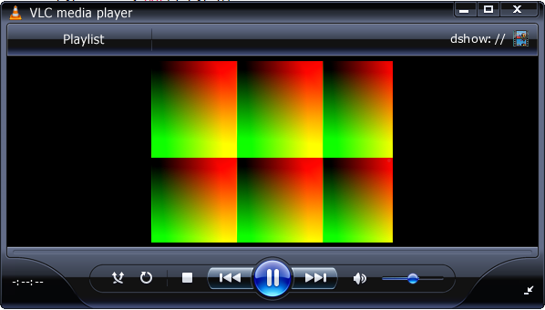
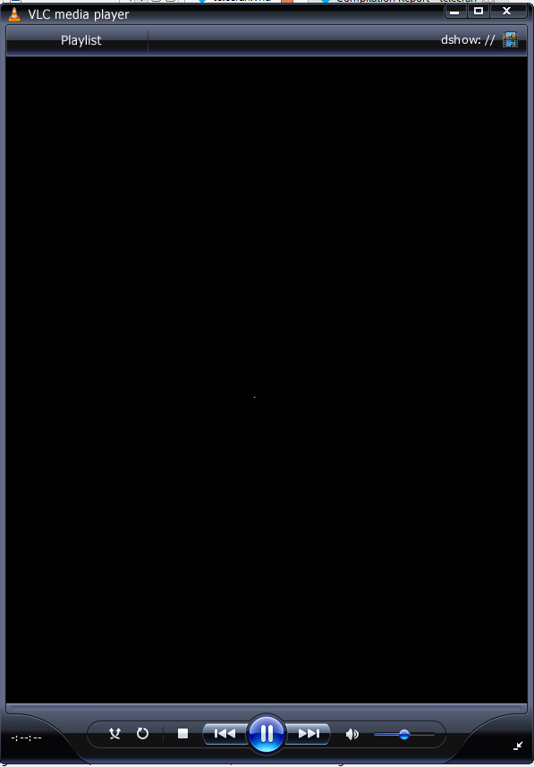

# TP_linux_embarque_HIMED_BENJEMAA

# TP – Écran magique

## Introduction

Dans ce TP, l’objectif est de concevoir une version numérique de l’**écran magique** (ou télécran) à l’aide d’un FPGA.  
Le déplacement du stylet est assuré par des **encodeurs incrémentaux**, tandis que l’affichage sera réalisé via la sortie HDMI de la carte **DE10-Nano**.

Le projet est découpé en plusieurs parties, chacune suivant la démarche classique de conception en logique numérique :
- conception du schéma,
- implémentation en VHDL,
- simulation sous **ModelSim**,
- test sur la carte FPGA à l’aide de **Quartus Prime Lite**.

---

## 1. Gestion des encodeurs

Cette première partie se concentre sur la **gestion des encodeurs incrémentaux**.  
L’affichage est volontairement mis de côté afin de se focaliser sur l’acquisition des signaux, la détection des fronts et la détermination du sens de rotation.

### Détection d’un front montant / descendant avec deux bascules D

Le montage utilisant **deux bascules D en série** permet de mémoriser :
- l’état **courant** du signal,
- l’état **précédent** du signal,

tous deux échantillonnés sur le signal d’horloge `clk`.

#### Principe

On note :
- `q0` : sortie de la **première bascule D** → état courant du signal
- `q1` : sortie de la **seconde bascule D** → état précédent du signal

En comparant ces deux valeurs, on peut détecter les fronts :

- **Front montant (0 → 1)**
- **Front descendant (1 → 0)**


Ces signaux (`rise` et `fall`) sont des **impulsions d’un seul cycle d’horloge**.

Dans le schéma fourni, le bloc `???` correspond à cette **logique combinatoire**, chargée de comparer `q0` et `q1` afin de générer le signal d’événement `E`.

---

### Prise en compte du sens de rotation (encodeur en quadrature A/B)

Un encodeur incrémental fournit deux signaux `A` et `B` en **quadrature**.  
Le sens de rotation est déterminé en observant l’état de l’autre signal au moment du front.

#### Règles de décision

**Incrémenter le registre :**
- `riseA` lorsque `B = 0`
- `fallA` lorsque `B = 1`

**Décrémenter le registre :**
- `riseB` lorsque `A = 0`
- `fallB` lorsque `A = 1`


```vhdl
-- Synchronisation des voies A et B (encodeur gauche)
r_A_sync_left <= r_A_sync_left(0) & i_left_ch_a;
r_B_sync_left <= r_B_sync_left(0) & i_left_ch_b;
```
sync(0) : état courant du signal
sync(1) : état précédent du signal

Cette étape permet d’éviter la métastabilité et de disposer de deux échantillons consécutifs pour détecter les fronts.


## Implémentation de la solution en VHDL
### Détection des fronts montants et descendants

À partir des deux échantillons, on peut détecter les fronts :

```vhdl
v_A_rising  := (sync_A(0) = '1' and sync_A(1) = '0'); -- front montant
v_A_falling := (sync_A(0) = '0' and sync_A(1) = '1'); -- front descendant
```

un front montant correspond à une transition 0 → 1
un front descendant correspond à une transition 1 → 0
Ces signaux sont des impulsions d’un seul cycle d’horloge.

### Détermination du sens de rotation (quadrature)

Un encodeur incrémental fournit deux signaux A et B en quadrature.
Le sens de rotation est déterminé en observant le front détecté sur une voie et l’état instantané de l’autre voie.

Incrémentation de la coordonnée : 
```vhdl
if (A_rising and B = '0') or (B_falling and A = '0') then
    coord <= coord + 1;
end if;
```
Décrémentation de la coordonnée : 
```vhdl
if (B_rising and A = '0') or (A_falling and B = '0') then
    coord <= coord - 1;
end if;
```
Cette logique permet de distinguer les deux sens de rotation de l’encodeur.

###  Saturation des coordonnées

Les coordonnées sont limitées à une plage valide (ici 10 bits) afin d’éviter tout débordement :
```vhdl
if coord < MAX_COORD then
    coord <= coord + 1;
end if;

if coord > 0 then
    coord <= coord - 1;
end if;
```

### Conclusion :

La gestion des encodeurs repose sur :
- la synchronisation des entrées,
- la détection des fronts,
- l’exploitation de la quadrature A/B pour déterminer le sens,
- la mise à jour sécurisée des coordonnées.

Ce module fournit ainsi des coordonnées X et Y fiables, utilisables par la suite pour le déplacement du stylet sur l’écran magique.

## 2. Contrôleur HDMI

### Objectif

- Réutiliser le composant `hdmi_controler` développé en TD.
- Générer les signaux vidéo (HS, VS, DE).
- Récupérer les coordonnées pixel `x` et `y`.
- Produire une image de test visible à l’écran.
- Vérifier la correspondance des composantes couleur.

---

### Instanciation du contrôleur HDMI

Le contrôleur est cadencé par l’horloge issue de la PLL.

```vhdl
u_hdmi : entity work.hdmi_controler
port map (
  i_clk   => s_clk_27,
  i_rst_n => s_rst_n,

  o_hdmi_hs => o_hdmi_hs,
  o_hdmi_vs => o_hdmi_vs,
  o_hdmi_de => o_hdmi_de,

  o_pixel_en      => open,
  o_pixel_address => open,
  o_x_counter     => s_x_counter,
  o_y_counter     => s_y_counter
);
```

### Rôle des signaux importants :

- `o_hdmi_hs`, `o_hdmi_vs` : synchronisations horizontale et verticale  
- `o_hdmi_de` : Data Enable (zone visible)  
- `o_x_counter`, `o_y_counter` : coordonnées du pixel courant  


### Génération d’une image de test :
Pour valider le pipeline HDMI, on génère une image simple à partir des compteurs x et y.

- o_hdmi_tx_d(23 downto 16) <= std_logic_vector(to_unsigned(s_x_counter, 8)); -- Rouge
- o_hdmi_tx_d(15 downto 8)  <= std_logic_vector(to_unsigned(s_y_counter, 8)); -- Vert
- o_hdmi_tx_d(7 downto 0)   <= (others => '0');                                -- Bleu

On obtient un dégradé :
- horizontal → rouge
- vertical → vert

### Correspondance des bits couleur :

Le bus vidéo est codé sur 24 bits (RGB 8:8:8) :

- o_hdmi_tx_d(23 downto 16) → Rouge (R)
- o_hdmi_tx_d(15 downto 8) → Vert (G)
- o_hdmi_tx_d(7 downto 0) → Bleu (B)

### Résultat obtenu :



L’écran affiche des carrés en dégradé rouge/vert, confirmant le bon fonctionnement du contrôleur HDMI.
Cette image valide les timings HS / VS / DE, les compteurs X et Y et la génération correcte des pixels.

### Conclusion :

Le contrôleur HDMI est fonctionnel et correctement intégré.
Le système est maintenant prêt pour les étapes suivantes :
affichage du curseur et implémentation de l’écran magique.


## 3. Déplacement d’un pixel

Cette étape consiste à afficher **un seul pixel blanc** qui se déplace en fonction des deux encodeurs :
- encodeur gauche → déplacement horizontal (**X**)
- encodeur droit → déplacement vertical (**Y**)

Le contrôleur HDMI fournit les coordonnées du pixel en cours d’affichage grâce aux compteurs :
- `o_x_counter` : coordonnée X (0 → h_res-1)
- `o_y_counter` : coordonnée Y (0 → v_res-1)

Le module `encoder_manager` fournit la position du “stylet” :
- `s_coord_x` : position X (encodeur gauche)
- `s_coord_y` : position Y (encodeur droit)

---

### Principe demandé par l’énoncé

On affiche la couleur **blanche** (`x"FFFFFF"`) si et seulement si :

- `x_counter == coord_x` **ET**
- `y_counter == coord_y`

Sinon, on affiche la couleur **noire** (`x"000000"`).

---

### Modifications dans `telecran.vhd`

1) Récupérer les compteurs X/Y du contrôleur HDMI (ne pas les laisser en `open`) :

```vhdl
signal s_x_counter : natural;
signal s_y_counter : natural;
```

```vhdl
o_x_counter => s_x_counter,
o_y_counter => s_y_counter
```

```vhdl
o_hdmi_tx_d <= x"FFFFFF"
  when (o_hdmi_tx_de = '1'
        and s_x_counter = to_integer(s_coord_x)
        and s_y_counter = to_integer(s_coord_y))
  else x"000000";
```

### Résultat attendu :

- Fond noir
- Un pixel blanc visible
- Le pixel se déplace quand on tourne les encodeurs : encodeur gauche → mouvement horizontal et encodeur droit → mouvement vertical.




